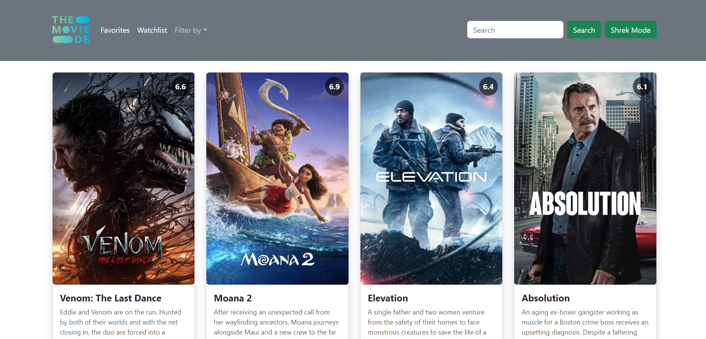
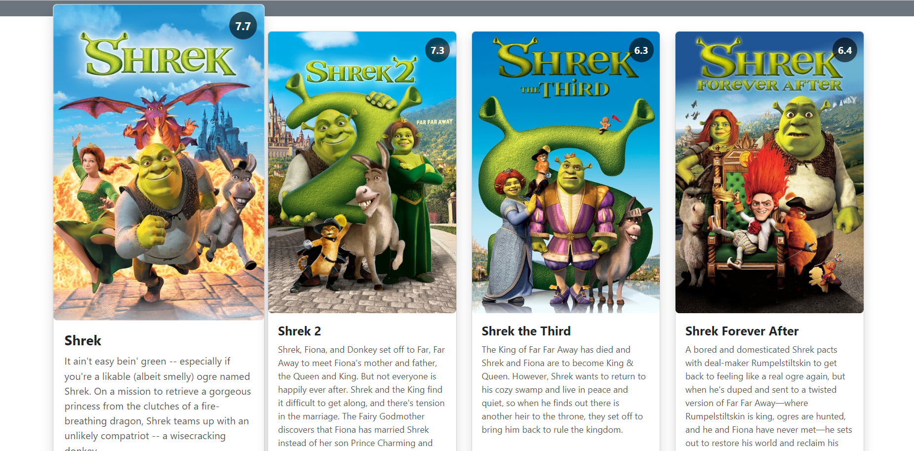
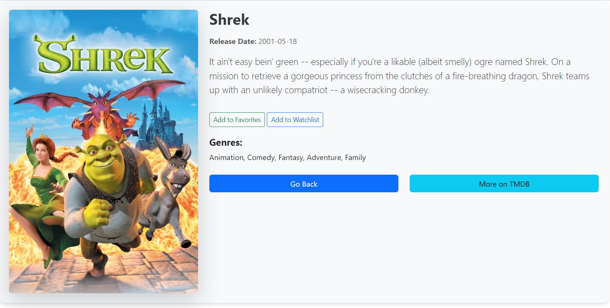
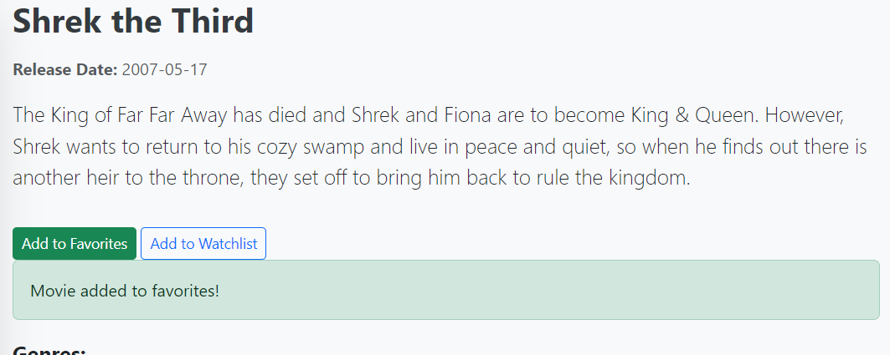
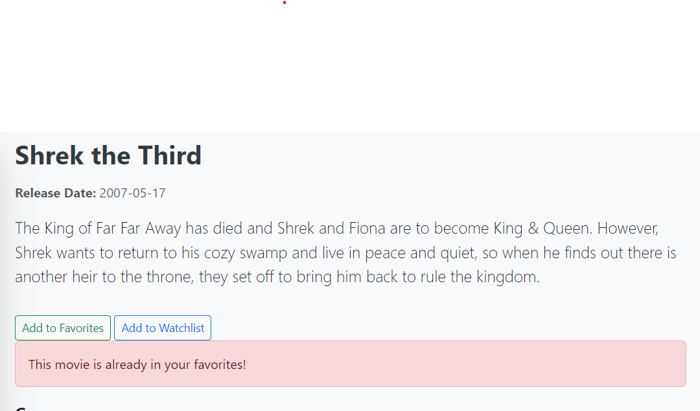

# TMDB PROJECT

## Description

This project uses the **TMDB (The Movie Database)** API to display the newest movies and allow custom searches filtered by title  and genre. 
Users also can explore a variety of movies, view details, and browse through specific categories.

Please note that in order to use this project you need to make a free account in TMDB to obtain a key and then make queries, this will be all explained below so don't worry.

## Preview

As you won't be capable of using this unless you first make your account, we think it's a good idea to show you how the app is built.

This is the first thing you'll see when you run the app, the newest films.


Once you are on them, it has a transition to make it more dynamic.


If you click on them, you're being redirected to see more details of the film as you can see


Also, as you can see, you can add it to your favourites or to your watchlist



If it is already added in your watchlist or in your favourites...



This is only a sneak peek of what you can do with the app, if you want to see more you'll have to try it for yourself!

## Features

- View the most recent movies.
- Filter movies by title and genre.
- Add movies to your watchlist or to your personal favourites.
- Shrek Mode, a silly but fun feature we had joy creating.

## Technologies Used

- **JavaScript**: For dynamic interaction with the API.
- **HTML/CSS**: For the structure and styling of the page.
- **Vite**: For fast development and packaging.

## Installation

### Prerequesites

- Node.js installed on your PC.
- A TMDB account to get an API key.

### Setup

1. Clone this repository:
   ```bash
   git clone https://github.com/oligarc/TMDB-PROJECT.git
2. Navigate to the project directory
   cd TMDB-PROJECT
3. Install dependencies:
   npm install
4. Set up your TMDB API Key
   - Sign up on [TMDB](https://www.themoviedb.org/)
   - Go to your account settings and get your API key.
   - Add your API key to the appropriate file (in our case we made an .env file to store there the key, so...)
5. **(Optional)** Store the API Key in a .env file  
   
   Make sure you have the dotenv dependency installed!. Then, make a .env file at the root directory. 

   Follow this structure --> VITE_API_KEY=your_key  

   Then, in the .gitignore include this line --> .env  

   There you go!
6. **(Optional)** How to use the key if stored in .env  
7. 
   In the js, follow this again --> const API_KEY = import.meta.env.VITE_API_KEY  
   
   Then in the functions you won't have any problems
8. The Favorites and Watchlist movie storing uses json-server. In order to be able to run the app we need to start both the json-server and Vite's own server at the same time. Some configuration is needed:

   - First of all, **json-server** and **npm-run-all** dependencies need to be installed

   - To redirect the main API request to the private API, a line of code must be added to the **vite.config.js** file inside defineConfig():

      ```javascript
      server: {
         proxy: {
            "/api": {
            target: "http://localhost:3000",
            changeOrigin: true,
            rewrite: (path) => path.replace(/^\/api/, ""),
            },
         },
      },

   - To start both servers at the same time, two scripts will be added to the **package.json** file to make things faster. The first one will shorten the json-server start and the second one will start both servers in parallel using npm-run-all:

      ```json
      "json-server": "json-server --watch src/db/db.json --port 3000",
      "serve": "npm-run-all --parallel dev json-server",

9. That's all! Now use the **npm run serve** (instead of the traditional **npm run dev**) command and the app will be up and running!


## Work distribution
- Oliver: 
   - TMDB api access
   - Overall design
   - Filters

- Juan: 
   - API key configuration
   - json-server configuration
   - Watchlist and Favorites management

## License

This project is licensed under the MIT License. See the [LICENSE](LICENSE) file for more details.

## Contact

- [Oliver LinkedIn](https://www.linkedin.com/in/%C3%B3liver-garc%C3%ADa-rodr%C3%ADguez/)
- [Oliver GitHub](https://github.com/oligarc)

- [Juan LinkedIn](https://www.linkedin.com/in/juan-villoslada-jimenez/)
- [Juan GitHub](https://github.com/jvillos)
